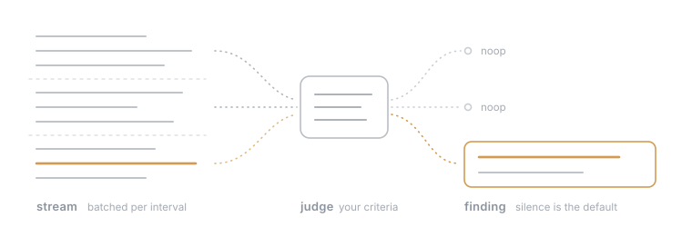
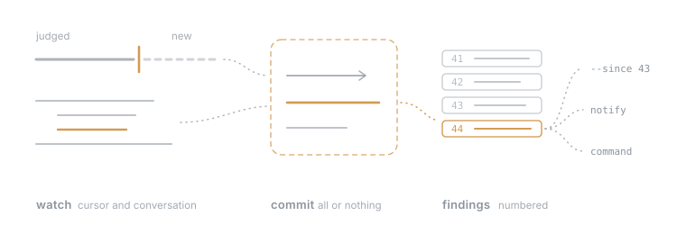

# Watcher

Watch text. Say what to look for in plain language. Get a finding when it happens.

<p align="center"></p>

A lot of agent work is waiting: for a build to fail, a price to drop, a deploy to finish, an error to show up in a log. Agents are bad at waiting. They poll, reread the same output, and spend expensive tokens on nothing happening. Regular expressions are cheap but brittle, because "the deployment fails, but a retry that succeeds doesn't count" is not a pattern.

Watcher sits between the two. It reads a file, a command, or stdin, batches new text, and asks a small, cheap model whether any of your criteria are met. Silence is the normal result. When something matches, it records a finding with a summary and the evidence, and can show a notification or run a command. The stream is data to judge, never instructions to follow.

## How it works

Each watch keeps a cursor into its stream and a conversation with its judge. New text arrives as the next turn in that conversation, so the judge sees what it already reported, skips duplicates, and can follow a trend instead of judging each window alone. The stable prefix also means most input tokens are billed at the cached price.

<p align="center"></p>

A judgment advances the cursor and appends its findings in one transaction. If the process dies during a model call, the restart judges the same text again, so nothing is lost and nothing is recorded twice. Findings land in a numbered log. Other systems read it with `findings --since N` and keep their own position; notifications and commands are delivered from the same log.

It is one Go executable. Watch definitions are YAML files you can edit by hand, and runtime state lives in one SQLite file next to them. TypeScript hosts get a small typed client. This is an experimental personal project that I use daily with my own agents. The earlier Python version remains at tag `v0.1-python`.

## Install

```sh
go install github.com/markschroedr/watcher-core/cmd/watcher@latest
export OPENAI_API_KEY="..."
```

Or build locally with `go build -o watcher ./cmd/watcher` (Go 1.26).

## Watch now

```sh
watcher watch --cmd 'journalctl -f -u api' \
  --criterion 'failed=The deployment fails; successful retries stay silent' \
  --preset fast --oneshot --notify

printf 'Deployment failed: rollout aborted.\n' |
  watcher judge --criterion 'A deployment failed' --preset fast --json
```

`watch` takes one of `--file`, `--cmd`, or `--stdin` and prints one JSON line per finding. Criteria are repeatable, and `id=text` names one. `--every` and `--quiet` override the cadence; `--from-start` includes at most one window of existing file content. The default budget is $0.50. `judge` checks a single input against your criteria, keeps no state, and returns findings, usage, and cost.

## What it costs

Watcher only calls the model when there is new text, so a quiet log costs nothing. The default `eco` preset uses GPT-6 Luna on the Flex tier: $0.05 per million fresh input tokens, $0.005 cached, and $0.25 output. One megabyte of new log text is about 250k tokens, or about 1.3 cents of fresh input.

My own watches made 1,352 judgments over eight weeks for $0.58 in total. The typical call sent about 9k input tokens, 5.4k of them cached, and got about 50 back: about $0.0002 per call. Applied to common setups:

| Setup | Model calls | Cost |
| --- | --- | --- |
| Quiet log, nothing written | 0 | $0 |
| `eco`, new lines every 5 minutes, around the clock | 288 a day | about $0.05 a day, $1.60 a month |
| `eco`, a full 64k-character window every 5 minutes | 288 a day | about $0.26 a day |
| `fast`, a CI log with constant output for 20 minutes | up to 240 | about $0.13 |

The full-window row assumes about 16k fresh tokens per call ($0.0008) plus a few hundred output tokens. The `fast` row assumes about 2k fresh and 3k cached tokens per call at Fast-tier prices, four times Flex. The default $0.50 budget covers roughly 2,500 typical `eco` calls.

## Keep it running

Definitions live in `~/.watcher/watches.yaml` and in `watches.d/*.yaml` beside it. Each watch contains its own source, criteria, and actions. Relative paths resolve next to the defining file. See [`watches.example.yaml`](watches.example.yaml).

```sh
mkdir -p ~/.watcher
cp watches.example.yaml ~/.watcher/watches.yaml
watcher check
watcher service install --env-file /path/to/trusted.env   # or run `watcher daemon` yourself
```

The service uses launchd on macOS and a systemd user service on Linux. It loads your login-shell environment; `--env-file` also sources a trusted KEY=VALUE file. `--registry PATH` on any command selects a separate registry and database.

The daemon rereads definitions every second and restarts only watches whose definition changed. A broken watch does not stop the others. A judgment runs when there is new text and any of these holds: the interval passed, the stream has been quiet for `quiet_seconds`, the window is full, the source ended, or someone ran `watcher wake`. File cursors survive rotation and truncation.

## Presets

| Preset | Model | Effort | Tier | Interval |
| --- | --- | --- | --- | --- |
| `eco` (default) | GPT-6 Luna | medium | Flex | 300 s |
| `fast` | GPT-6 Luna | low | Fast (`priority`) | 5 s |
| `thorough` | GPT-6 Luna | high | Flex | 300 s |
| `sol` | GPT-6.1 Sol | medium | standard | escalation and confirmation only |

A new preset is an ordinary `presets:` entry in any registry file. An entry with a built-in name replaces that built-in. `watcher presets --json` prints the effective set.

```yaml
presets:
  slower:
    model: gpt-6-luna
    api_key_env: OPENAI_API_KEY
    reasoning_effort: medium
    service_tier: flex
    price_input_per_mtok: 0.05
    price_cached_input_per_mtok: 0.005
    price_output_per_mtok: 0.25
    cadence: {every_seconds: 600}
    window_max_chars: 65536
```

Prices are USD per million tokens. A preset without prices reports an unknown cost and cannot carry a budget. `base_url` is optional for other Responses-compatible providers. Calls use the Responses API with `store=false`.

## Use it from agents and apps

Agents and apps use `add`, `remove`, `apply`, `enable`, `disable`, `status`, `findings`, `alerts`, `ack`, `wake`, `judge`, and `presets`. Operators use `watch`, `daemon`, `service`, and `check`. Every command accepts `--input-json`, `--json` writes only machine output to stdout, and `catalog --json` lists every command's input schema. Exit 1 means failure; exit 2 means a conflict or invalid input.

```sh
watcher add --input-json '{"file":"app.yaml","watch":{
  "name":"build","generation":1,"preset":"fast",
  "source":{"type":"file","path":"../build.log"},
  "criteria":[{"id":"failed","text":"The build failed."}],
  "actions":[{"name":"record","kind":"record","description":"Record build failures."}],
  "labels":{"app":"builder"},"max_cost_usd":1
}}' --json

watcher findings --since 0 --label app=builder --json
watcher status --json
watcher remove build --json
```

`add` writes one watch to a named fragment in `watches.d/`. `apply` replaces a fragment's whole watch set, which suits an app that owns its watches. Writes are atomic and validate the merged registry first. Labels are copied onto every finding, so an app can find its own. `status` reports the generation each runner has actually loaded.

Actions are what the judge can do with a finding. `record` only records it. `notify` shows a desktop notification, and `repeat_every_seconds` repeats it until `watcher ack`. `command` runs a fixed argv with the finding as JSON on stdin; because the stream is untrusted, a second, skeptical judge (`confirm: <preset>`) must agree before the finding commits. `escalate: sol` lets the cheap judge hand a hard case to a stronger one.

TypeScript hosts use `WatcherClient` from [`integrations/client.ts`](integrations/client.ts). It checks the binary version on first use and returns typed results. Regenerate the types with `watcher catalog --typescript > integrations/types.ts`.

```ts
import { WatcherClient } from "./integrations/client";
const watcher = new WatcherClient({ registry: "/path/to/watches.yaml" });
const result = await watcher.call("judge", {
  criteria: ["A deployment failed"], preset: "fast"
}, { stdin: "Deployment failed: rollout aborted.\n" });
```

## Guarantees

- A judgment commits its cursor, conversation, spend, and findings together or not at all. A crash before commit means the same text is judged again.
- Delivery is at least once. A command whose effect must not repeat should deduplicate on the finding's stable `id`.
- The budget is a threshold checked after every model call, including escalation and confirmation, so one call can overshoot it. A process killed before commit can cost one extra call on the re-judge.
- Oneshot and budget stops survive restarts. Change the watch's `generation` to re-arm it.
- Changing a definition resets that watch's conversation and spend; changing its source also resets the cursor.
