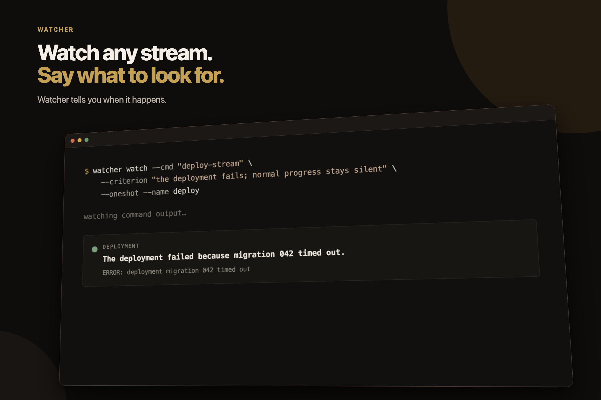

<p align="center">
  
</p>

<h1 align="center">Watcher</h1>

<p align="center">
  Watch text. Say what to look for. Get an alert when it happens.
</p>

Watcher does three things:

1. Read text from a file, command, or standard input.
2. Check for something you described in plain English.
3. Print a result, show an alert, or run a command when it happens.

Use it to watch logs, wait for a build, check prices, follow a sensor, or monitor
an inbox. The text and the condition change. Watcher stays the same.

Agents can use Watcher to watch things cheaply instead of checking again and
again. Watcher can also monitor agent runs, error streams, logs, and public
feeds.

## Install

```sh
uv tool install git+https://github.com/markschroedr/watcher-core.git
export OPENAI_API_KEY="..."
```

## Watch

```sh
watcher watch \
  --cmd "journalctl -f -u api" \
  --criterion "the deployment fails; successful retries stay silent" \
  --notify
```

Use `--file`, `--cmd`, or `--stdin`. Add `--oneshot` when the first finding
should end the watch.

## Keep it running

```sh
mkdir -p ~/.watcher
cp watches.example.yaml ~/.watcher/watches.yaml
watcher service install
watcher status
```

Watcher saves its place and starts again after a restart. Edit
`~/.watcher/watches.yaml` to add or change watches.
